# Procesverslag van Nikki Okker

## Jij

  ### Auteur:
  Nikki Okker

  #### Je startniveau:
  Blauw

  #### Je focus:
  De website van Kukuru volledig responsive maken
 

## Je website

  ### Je opdracht:
  https://kukuru.nl/

  #### Screenshot(s) van de eerste pagina (small screen): 
  https://kukuru.nl/category/podcast/
  

  #### Screenshot(s) van de tweede pagina (small screen):
  https://kukuru.nl/2022/10/23/willemijn-welten-kukuru-157/
  
 

## Toegankelijkheidstest 1/2 (week 1)

  ### Bevindingen van Kukuru test
  Lijst met je bevindingen die in de test naar voren kwamen:

  #### Screenreader
  ##### Pagina 1: Podcasts
  1. Bevinding 1: Wanneer ik de Kukuru site open op de homepagina, dan kan ik wél de screenreader starten. Wanneer ik de   
   'podcast' pagina open en dan pas de screenreader start, dan doet de screenreader het niet. Het zegt steeds "dat je  
    niet naar de content kan komen". Ik moet echt op de homepagina starten met de 
  screenreader, want de screenreader doet het niet op andere pagina's als je ermee start. 
  2. Bevinding 2: De titel van Kukuru podcasts pagina heeft een gekke titel, je kunt namelijk op deze pagina door de 
   afleveringen heen scrollen. Kukuru is al een podcast, dus ik zou de naam van deze pagina veranderen naar 'podcast 
    afleveringen of kukuru afleveringen'. 
  3. Bevinding 3: Wanneer je bij de eerste box met content aankomt van één van de afleveringen, dan zegt de website: 
   'Linkbox' en daarna 'link 2'. Dit zou efficienter en duidelijker kunnen, want het linkt beide naar dezelfde aflevering, 
    alleen de tweede link is eigenlijk een afbeelding. De alt-tekst heirvan zou afbeelding van Giel en Charlotte Labee 
     kunnen zin.
  4. Bevinding 4: Bij de knop 'Bekijk', zegt de reader dat het een link is, maar het is eigenlijk een knop. Daarbij is de 
   tekst misleidend, want je krijgt alleen de aflevering te lezen, en te horen en je kunt niet echt wat zien alsin dat je 
    direct de beelden van de podcast krijgt of dat je direct de podcast gast hoort praten.
  5. Bevinding 5: Bij categorieën wordt er de heletijd '.' opsommingsteken gezegd, terwijl dit ook efficienter kan, want 
   nu hoor je steeds: opsommingsteken dit, opsommingsteken dat.. Terwijl je alleen de categorieen wilt horen en niet de 
    geheletijd het woord 'opsommingsteken'. 
  6. Bevinding 6: De titel 'De populairste kukuru podcasts, zou ik veranderen naar: de populairste afleveringen. 

  ##### Pagina 2: Podcast met Willemijn Welten
  1. Bevinding 1: Wanneer je door deze pagina heen scrolt, kom je bij de datum van de aflevering. Daar wordt gezegd dat 
  het een lijst is met 1 item. Maar het is geen lijst. Dit is gek gecodeerd. 
  2. Bevinding 2: De afbeelding wordt gek omschreven op deze pagina. Hier zou ik een tekst als alt-tekst bijzetten met 
  "Afbeelding aflevering met Willemijn Welten". 
  3. Bevinding 3: Beluister podcast Spotify kan niet met enter. 
  4. Bevinding 4: Beluister podcast met YouTube kan niet met screenreader. 
  5. Bevinding 5: Er is een boekenkopje dat mist voor het vinden van de boeken die Willemijn het leukste vind. 
  6. Bevinding 6: Banner link Storytel x Kukuru zou je betere alt-tekst kunnen neerzetten. 

  #### Muis en Toetsenbord 
  Je kunt bij met tab niet terug door de website heen. Het is duidelijk wat geselecteerd is, wat de focusstand is, alleen 
  visueel wel erg beperkt, gezien je alleen een paar stippel lijntjes ziet. Voor het navigatie menu maakt dit niet uit, 
  maar voor de contentblokken is het erg onduidelijk. Dit kun je oplossen door het visueel dikker of qua kleur  
  duidelijker te maken. Dit geldt vervolgens ook voor alle content op beide pagina's wanneer je er met tab doorheen gaat 
  is het niet dudielijk waar je je precies bevind. De pijltjes werken ook niet alleen tab. 

  #### Motoriek (shocks, elastiekjes)
  ##### Elastiekjes: 
  De elastiekjes zijn geen pretje. Je kunt je handen lastig bewegen, waardoor je minder snel van de ene kant 
  naar de andere kant van de pagina kunt. Daarnaast is klikken ook moeilijker. Toch lukt het aardig, want de kukuru site 
  heeft veel links en knoppen om je doel te bereiken. Wat beter kan is content krachtiger neerzetten, waardoor je minder 
  van onder naar boven hoeft te scrollen. Zo kun je sneller in een kortere sleeptijd op de items (content) van de site 
  klikken.

  ##### Shocks: 
  Grotere knoppen kunnen helpen om minder specifiek te hoeven klikken. Door het shokken kun je minder goed op iets 
  klikken. Grotere vlakken om te klikken helpt dan. Maar bij de website van Kukuru is dat al goed geregeld, je kunt 
  klikken op de titel, de afbeelding, de knop. Alles is inprincipe gelinkt. Alleen de kleinere linkjes zijn lastiger in 
  bijvoorbeeld een tekst. 

  #### Visueel (brillen, contrast, kleurenblind, dark/light). 
  ##### Contrast: 
  Er is weinig contrast wanneer je kleurenblind bent in de site. Dit kunnen we oplossen door meer verschil in kleurgebruik 
  of donkere en lichtere kleuren. Toch is de site voor mensen die visueel niet belemmert worden wel mooi. Het roze op het 
  wit brengt veel contrast. De titels en buttons zouden daarintegen ander vormgegeven kunnenn worden. 

  ##### Kleurenblind: 
  Titels en knoppen zijn qua kleur als je kleurenblind bent erg hetzelfde, er zit weinig contrast in. Het blijft visueel 
  wel behapbaar als in dat het niet te druk is om de site te bekijken. Wat ik zou doen is de knoppen donkerder maken. (= 
  Blue Cone Monochromacy / Achromatomaly). In zwart/wit zie je geen contrast(= Monochromacy / Achromatopsia). Links vallen 
  weg (= Green-Blind / Deuteranopia / Red-Blind / Protanopia). 

  ##### Dark/Light mode: 
  Kukuru heeft geen eigen darkmode op de site. Wanneer je zelf darkmode aanzet veranderd de site niet mee. Dit is erg fel 
  wanneer je het 's avonds bekijkt. Een hoofdpijn kleur qua licht. Dit kunnen we oplossen met een darkmode. 

  ##### Brillen: 
  De website met vlekjes is minder benaderbaar, dan als zonder maar nog steeds goed goed leesbaar. De fonts ook. Hier zou 
  ik niet veel aan aanpassen. De bril met de vlek in het midden was alsof je naar buiten keek. Want in het midden zie je 
  een grote zwarte vlek, dus je moest om die vlek heen kijken. Je zag dan wel wat, maar alleen door het bewegen van je 
  hoofd en niet door je ogen. De site zou je dan met kolommen kunnen indelen en korter en krachtiger de content weergeven. 

## Breakdownschets (week 1)

  ### de hele pagina 1: 
  

   ### de hele pagina 2: 
  

  ### dynamisch deel (bijv menu): 
  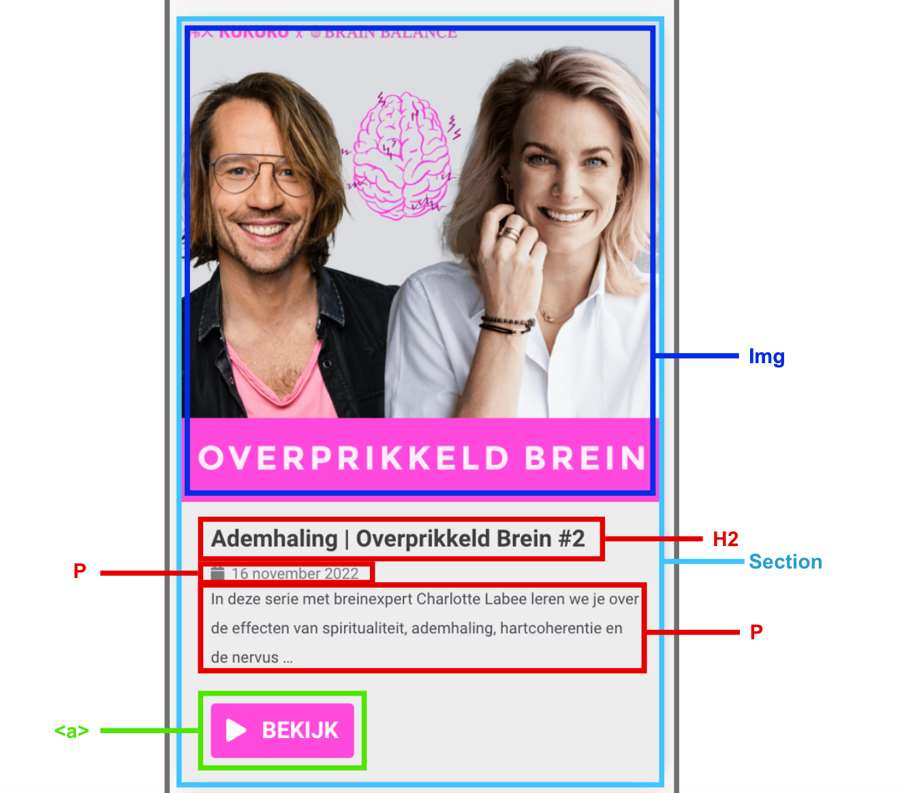

  ### wellicht nog een dynamisch deel (bijv filter): 
  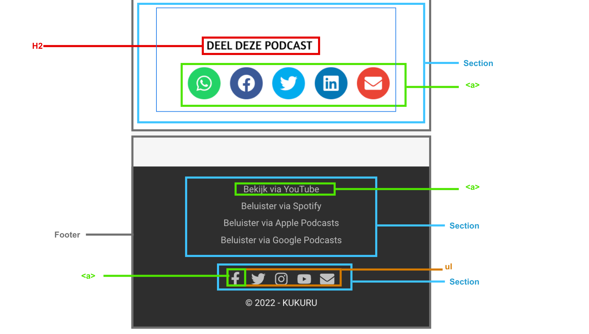

## Voortgang 1 (week 2)

  ### Stand van zaken
  Het opzetten van de HTML ging naar mijn mening goed. Toch wil ik checken of het semantisch klopt. Het is voor mij erg 
  logisch welke elementen ik in de DOM moet zetten. Toch weet ik niet goed waar ik moet beginnen. Ik ben begonnen met een 
  grid te maken van de content die op mijn website staat. Na het maken van de grid heb ik direct breakingpoints 
  toegevoegd. Dat wanneer er een breakingpoint is, er een andere column style wordt laten zien. Na dit toegepast te hebben 
  krijg ik weer error. Wat nu? Er is voor mij nog geen logische opbouw in het schrijven van de css. Daarnaast ben ik nog 
  niet zeker over mijn HTML alsin of het correct is. Ik ben blij dat er nu een voortgangsgesprek is. 

  ### Agenda voor meeting
  1. student 1: Jordy - Jordy wil graag wat vragen over zijn carroussel, verder is hij lekker bezig. 
  2. student 2: Lars -  Lars wil weten hoe hij zijn Home pagina aanzienlijker kan maken voor de gebruiker. Hoe hij audio 
  en video voor de gebruiker kan toevoegen aan zijn pagina. En ofpop ups in het nadeel of voordeel van zijn site werken. 
  3. student 3: Nikki - Mijn vragen zijn uitgebreid:
  
  #### Pagina 1: Podcast pagina
  1. Is mijn HTML semantisch correct? Want dat is de basis. Als dat goed staat kan ik aan de slag. 
  2. Hamburger menu: hoe zit dat? 
  3. Alles wat in een article staat, moet ik dat apart stylen? 
  4. De categorieën: hoe kan ik die beste vormgeven? Ook op de manier van de site of moet dat dan ook in een grid? En die 
  zoekbalk ook? En hoe maak ik die zoekbalk? 
  5. Footer: hoe kan ik footer van Kukuru namaken met name de opzet ervan. Html heb ik al. Het naast elkaar zetten is de 
  vraag. 

  #### Pagina 2: Aangeklikte podcast met Willemijn Welten
  1. Mag de class op de body doen, vanwege andere content styling met nth-of-type? 
  2. Hoe kan ik zo’n MP3 afspeler erin zetten? Zoals op kukuru website. 
  3. Hoe krijg ik net als bij kukuru website de boeken naast elkaar? Positioneren? Of flexbox? Of what else ??
 
  ### Verslag van meeting
  Vragen beantwoord op pagina 1, pagina 2 is niet gelukt: 
  - HTML ziet semantisch goed uit behalve sections, die articles moesten zijn. 
  - Hamburger menu komt in volgende les.
  - Focussen op eerst de ene website, dan de ander. 
  - Gebruik grid voor de footer. 

## Voortgang 2 (week 3)

  ### Stand van zaken
  De eerste website pagina, podcasts, ziet er goed uit. Er is nog niet in css gewerkt met de styling codes. Toch heb ik 
  het positioneren nu aardig opgezet. Het is momenteel erg responsive wat ik vanaf het begin al wilde bereiken. Nu ben ik 
  begonnen aan de tweede pagina van mijn site om deze qua vlakken op de juiste manier te positioneren. Dit doe ik met een 
  class op de body, zodat ik één css bestand kan behouden. Dit vind ik een uitdaging, maar ga ik fixen, zodat het er tof 
  uit gaat zien. Work in progress, it is!

  ### Agenda voor meeting
  1. student 1: Jordy - Jordy wil graag wat vragen over een SVG inline positioneren bij een h3. 
  2. student 2: Lars -  Lars wil het hebben over het maken van een goede header nav. Of je een hele footer moet maken.    
  Over het stijlen van een formulier. En grid op foto's. 
  3. student 3: Nikki - Ik wil graag focussen op het positioneren van mijn tweede pagina en daarna nog tip voor stijlen 
  van mijn eerste pagina. En ik wil een audio player op mn site maar ik snap niet hoe dat werkt :) Dus daar ga ik ook naar 
  vragen. Wat moet er semantisch correct beter?

  ### Verslag van meeting
  Uitkomsten na meeting:
  - De juiste selectoren kiezen, dat vind ik lastig, hierbij heeft Ine mij heel fijn bij geholpen. 
  -  Geleerd een parent een bepaalde width te geven en daarin images te positioneren dat het niet groter (max-width) kan  
  worden. 
  - Geluid voor beginners: hoe maak je met javascript een werkende button met geluid.
  - Marquee, een code om scrollende tekst mee te maken. 
  - Kleuren in de :root zetten als custom properties en gebruiken in css met var's. 

 

## Toegankelijkheidstest 2/2 (week 4)

  ### Bevindingen
  Lijst met je bevindingen die in de test naar voren kwamen (geef ook aan wat er verbeterd is):
   
  ##### Screenreader 
  1. Alle afbeeldingen checken op ALT tekst.
  2. Knop aria labels geven. 
  3. Icoon nog een naam geven. 
  4. links voorlezen (Link als tekst zetten en 'a' eromheen)
  5. Play knop een andere naam geven (aria label)

  ##### Muis en Toetsenbord
  1. De screenreader starten bij het begin (ligt maar net aan waar je met je muis in de pagina staat).
  3. States toevoegen aan site.

  ##### Motoriek
  1. Witte koppen iets verzinnen? Als extra's. 

  ##### Visueel
  1. Animatie toevoegen.
  2. States toevoegen.
  3. Darkmode toevoegen

  #### Screenreader
  ##### Eerste pagina: 
  - Je begint bij het logo linksboven in het menu met een goede alt-tekst. De screenreader leest goed voor wat het logo is 
  (met alt tekst) en wat voor content de lijst ernaast heeft —> Hierna gaat hij naar de lijst van de eerste nav —> De 
  eerste kop wordt voorgelezen —> dan gaat de screenreader verder naar de artikelen in het grid, waar elk element goed 
  wordt voorgelezen met alt tekst indien dit van toepassing is. Het is ook duidelijk wat een knop en wat een link is en 
  dat daar een icoon in zit, alleen is niet duidelijk wat voor icoon dit is. Hij zegt alleen ‘icoon’, en niks anders.

  - In de lijst onderaan de eerste sectie (het eerste grid) heb je die pagina navigatie waarin het vierde punt ‘…’ is, en 
  ook zo wordt opgelezen. Is hier een andere optie voor? Verder moet je nog in je button een aria-label zetten.

  ##### Tweede pagina:
  - In je artikel heb je een link uitgetypt. Dit leest de screenreader voor als https://bit.ly/KaartendeckManifesteren… 
  etc. Dit duurt echt superlang en is niet te doen: verbeterpunt!!!! 
  - In je podcast heb je een play-knop en een geluidknop. De playknop wordt voorgelezen als knop, maar de geluid knop als 
  afbeelding. Dit hoort niet. Verbeterpunt!!!!

  #### Muis en Toetsenbord 
  ##### Eerste pagina (index)
  Heel nice hoe je al je muis ziet veranderen als je hovert en zo een distinctie tussen verschillende elementen hebt. De 
  tabs, wanneer je met je toetsenbord navigeert, beginnen alleen bij de eerste 'Bekijk'-knop in je <main>, maar wat als 
  iemand door de bovenste nav wil navigeren? Daar kan je even naar kijken. Daarnaast wordt op de originele site de foto 
  groter als je hovert en is een heel vak een link, dat kan je verwerken om het makkelijker te maken om op één onderdeel 
  te klikken. Qua tekst die groter en roze wordt. Je hebt een goede hiërarchie wat kleuren betreft, dat is te zien bij 
  elke knop en header bij kleurenblindheid. Klikken gaat goed en soepel.

  ##### Tweede pagina (podcast)
  Ik kan niet met mijn toetsenbord door je pagina navigeren, alsof er nergens op deze pagina een link is (die zijn er 
  wel). Je hebt nog geen states weet ik, dus als iemand geen kleuren ziet is er nog geen manier om te zien waar je staat 
  op de pagina. Wel is het contrast mooi hoog en scherp, waardoor met elke mogelijke kleurenblindheid wel te zien is welk 
  element wat is.

  #### Motoriek (shocks, elastiekjes)
  ##### Visueel: 
  met Combined Loss Diabetic Eye Disease is het moeilijk om de witte koppen te lezen. Met Periphal Field  
  Loss is alles vaag en moet ik heel goed kijken, alles is vaag en ik moet dichterbij kijken om van alles te lezen.
  
  ##### Concentratieproblemen: 
  Omdat je alleen de knop klikbaar heb gemaakt is het lastig om goed te klikken terwijl je afgeleid 
  bent. Je kan beter de hele sectie klikbaar maken.

  ##### Motoriek: 
  gaat priem. Vanuit mn eigen slechte perspectief. Peace. 
  ##### Beperking: 
  gaat lastig, maar is wel bestuurbaar. 

  #### Visueel (brillen, contrast, kleurenblind, dark/light). 
  ##### Eerste pagina (index)
  Qua tekst die groter en roze wordt. Je hebt een goede hiërarchie wat kleuren betreft, dat is te zien bij elke knop en   
  header bij kleurenblindheid.

  ##### Tweede pagina (podcast)
  Het contrast is mooi hoog en scherp, waardoor met elke mogelijke kleurenblindheid wel te zien is welk element wat is.

## Voortgang 3 (week 4)

  ### Stand van zaken
  De website wordt door de CSS steeds mooier. Het gaat eigenlijk heel goed. Mijn eerste pagina heb ik bijna af, alleen  
  moet ik daar nog states toevoegen en de HTML / CSS netjes met comments verwerken in het bestand. Pagina twee is meer     
  werk aan de winkel, daar moet ik states toevoegen, de MP3 speler dinges nog verder maken en social media buttons meer    
  ruimte geven. Ook moet ik mijn html qua opbouw bij de articles veranderen, eerst een H1 en dan pas een img, niet    
  andersom. 

  ### Agenda voor meeting
  1. student 1: Jordy - Jordy wil graag zijn menu knoppen fixen, de knoppen van airbnb in bovenste gedeelte. Jordy wil ene 
  hartje over een plaatje zetten om het te kunnen "like". 
  2. student 2: Lars -  Lars wil het hebben over zijn navigatie balk. Hij wil het hamburger menu op mobile versie krijgen 
  en hij wilt kunnen scrollen door zijn sections.
  3. student 3: Nikki - Ik wil graag focussen op de MP3 Media player en ruimte krijgen tussen haar buttons van social     
  media. Daarnaast wilt ze graag weten hoe ze drie verschillende css bestanden goed semantisch correct van boven naar 
  beneden kan indelen. 

  ### Verslag van meeting
  Uitkomsten na meeting:
  - Doormiddel van grid de MP3 mediaplayer beter kunnen stijlen. 
  - De MP3 mediaplayer de selectoren daarvan zoeken en aantikken met juiste css styling. 
  Het vinden van een selector vind ik lastig, het benodigde op de selector zetten niet. 
  - Tips gehad om css bestand netjes in te delen. Van boven naar beneden, zonder spaties en met duidelijke comments. 

## Eindgesprek (week 5)

  ### Je uitkomst - karakteristiek screenshots:
  #### Pagina 1 - Podcast overzicht :
  

  #### Pagina 2 - Spreker Willemijn Welten:
  

  ### Dit ging goed/Heb ik geleerd: 
  De dingen die erg goed verliepen: 
  1. het opzetten van de html, dus alle content erin zitten. 
  2. Daarnaast vond ik het makkelijk en leuk om te stylen/vormgeven qua kleur en typografie.
  3. Zelf uitproberen en eruit komen met bepaalde dingen positioneren.

  Wat heb ik écht nieuw geleerd:
  1. Custom properties toevoegen aan css om elementen een kleur te geven.
  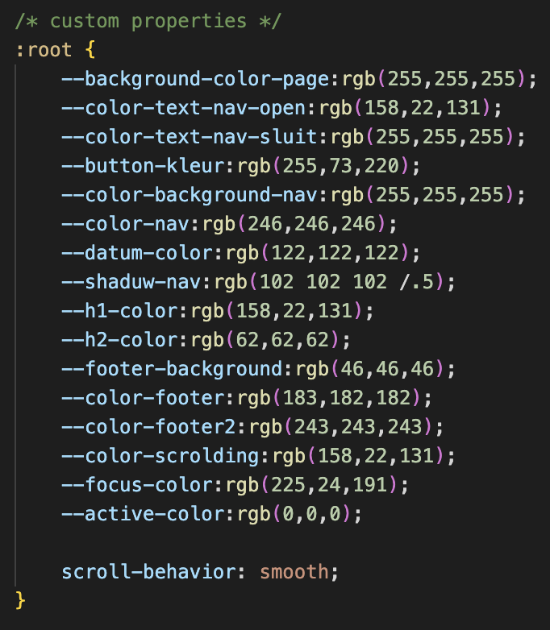

  2. Darkmode aanzetten, zodat als mensen in de avond naar de site kijken het prettiger is voor de ogen.
    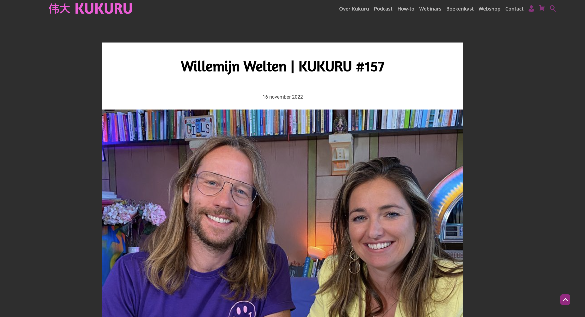
    
  3. Het hamburger menu om de site responsive te maken wanneer het op meerdere devices gebruikt word. 
  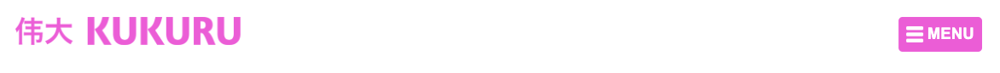

  4. Formulier vormgeven om iets in te typen.
  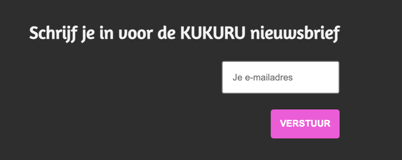

  5. Media query toevoegen zodat alle content op elk device nuttig is. 
    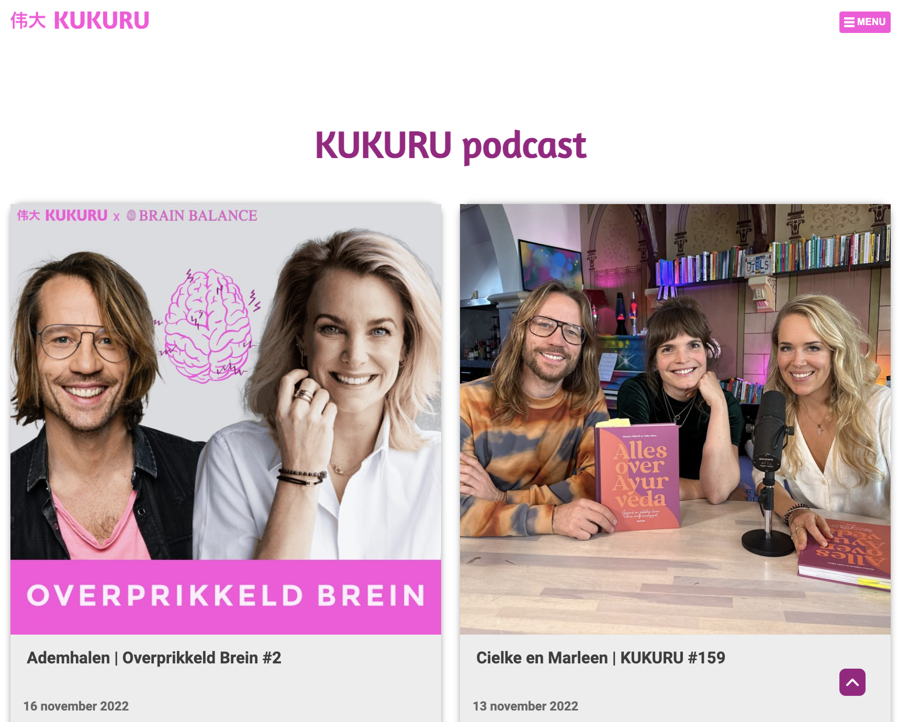
    
  6. Audio toevoegen aan een pagina.
  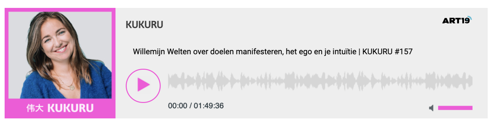

  7. States toevoegen zoals: focus, active, hover.
  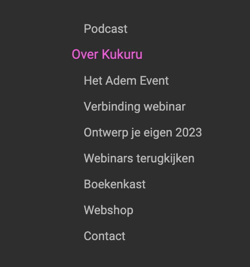
  
  8. Position gebruiken om iets sticky/fixed op een pagina te maken. 
  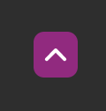

  ### Dit was lastig/Is niet gelukt:
  Wat vond ik lastig: 
  1. Nadat ik alle content in mijn html bestand had gezet moest ik alles gaan positioneren, dit vond ik echt moeilijk. Met 
  nam het gebruik maken van GRID. gezien ik nog nooit zoiets heb gedaan. 
  2. Ook position gebruiker met left, right, top en bottom lukte mij in begin niet. 
  3. Audio toevoegen aan de website. 
  4. States geven aan bepaalde iconen (Niet gelukt, dan alleen :hover).

  1. Grid geven aan mijn artikelen was moeilijk. 
    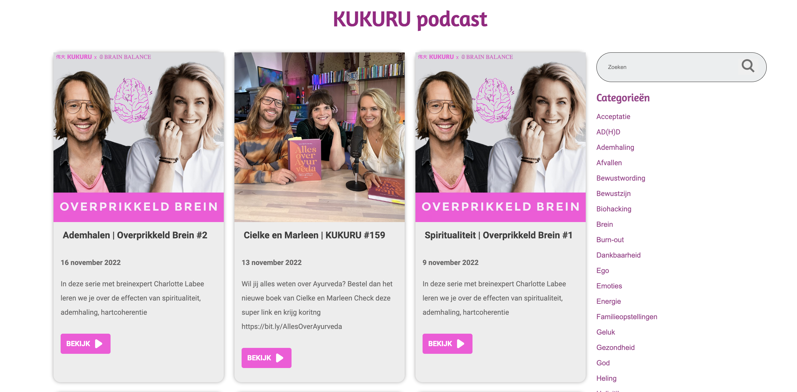

  2. Het hamburger menu op de site krijgen en responsive voor telefoon en pc was lastig, maar is gelukt! 
  

  3. States toevoegen aan social icons, lastig. 
    

  ## Bronnenlijst:
  ### Dit zijn de bronnen die ik heb gebruikt:
  1. Alle content op de website voor pagina 1 (tekst + afbeeldingen) bron 1: https://kukuru.nl/category/podcast/
  2. Alle content op de website voor pagina 2 (tekst + afbeeldingen) bron 2: https://kukuru.nl/2022/10/23/willemijn- 
  welten-kukuru-157/
  3. Video om te begrijpen hoe custom properties werken. bron 3: https://www.youtube.com/watch?v=PHO6TBq_auI&feature=youtu.be & https://codepen.io/shooft/pen/ZEyOOLM om de begin code te kopieëren. 
  4. Deze code gebruikt van Sanne voor de basis van mijn hamburgermenu en een darkmode. bron 4: https://codepen.io/shooft/pen/xxzjJeW
  5. Deze code toegepast voor het maken van audio op mijn website. bron 5: https://codepen.io/shooft/pen/gOKBaMm
  6. Deze code gebruikt om erachter te komen hoe je een invoerveld gebruikt. bron 6: https://www.htmlschool.nl/les4.html 
  7. Deze code toegepast om screenreader jusit te laten lezen (aria label). bron 7: https://www.aditus.io/aria/aria-label/
  8. Deze code overgenomen om mijn states bij hover te laten inzoomen. bron 8: https://www.w3schools.com/howto/tryit.asp?filename=tryhow_css_zoom_hover
  9. Hoe <time> op de juiste manier gebruiken? bron 9: https://www.geeksforgeeks.org/html-time-datetime-attribute/
  10. Ronde buttons maken voor mijn mp3 speler. bron 10:https://www.w3schools.com/howto/howto_css_round_buttons.asp

