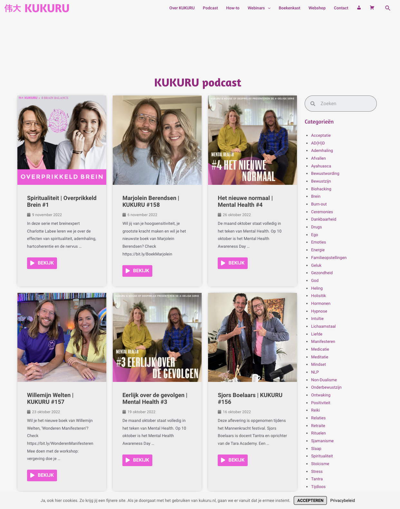
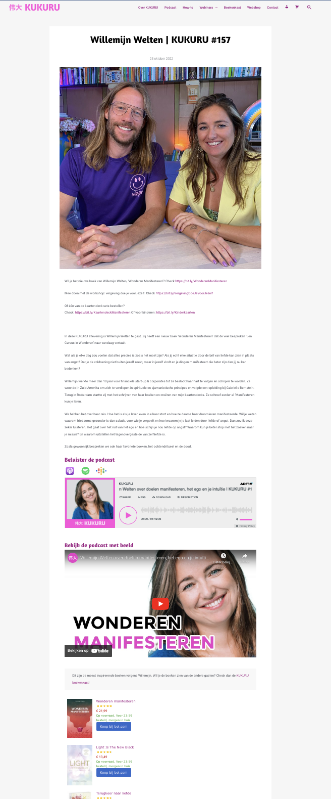

# Procesverslag
Markdown is een simpele manier om HTML te schrijven.  
Markdown cheat cheet: [Hulp bij het schrijven van Markdown](https://github.com/adam-p/markdown-here/wiki/Markdown-Cheatsheet).

Nb. De standaardstructuur en de spartaanse opmaak van de README.md zijn helemaal prima. Het gaat om de inhoud van je procesverslag. Besteedt de tijd voor pracht en praal aan je website.

Nb. Door *open* toe te voegen aan een *details* element kun je deze standaard open zetten. Fijn om dat steeds voor de relevante stuk(ken) te doen.

## Jij

  
uitwerken voor kick-off werkgroep

  ### Auteur:
  Nikki Okker

  #### Je startniveau:
  Blauw

  #### Je focus:
  Surface plane
 

## Je website

  
uitwerken voor kick-off werkgroep

  ### Je opdracht:
  https://kukuru.nl/

  #### Screenshot(s) van de eerste pagina (small screen): 
  https://kukuru.nl/category/podcast/
  

  #### Screenshot(s) van de tweede pagina (small screen):
  https://kukuru.nl/2022/10/23/willemijn-welten-kukuru-157/
  
 

## Toegankelijkheidstest 1/2 (week 1)

  
uitwerken na test in 1e werkgroep

  ### Bevindingen van Kukuru test
  Lijst met je bevindingen die in de test naar voren kwamen:

  #### Screenreader
  Hier korte omschrijving (met indien nodig afbeeldingen)

  Pagina 1: Podcasts
  Bevinding 1: Wanneer ik de Kukuru site open op de homepagina, dan kan ik wél de screenreader starten. Wanneer ik de 'podcast' pagina open en dan pas de     
  screenreader start, dan doet de screenreader het niet. Het zegt steeds "dat je niet naar de content kan komen". Ik moet echt op de homepagina starten met de 
  screenreader, want de screenreader doet het niet op andere pagina's als je ermee start. 
  Bevinding 2: De titel van Kukuru podcasts pagina heeft een gekke titel, je kunt namelijk op deze pagina door de afleveringen heen scrollen. Kukuru is al een podcast, dus ik zou de naam van deze pagina veranderen naar 'podcast afleveringen of kukuru afleveringen'. 
  Bevinding 3: Wanneer je bij de eerste box met content aankomt van één van de afleveringen, dan zegt de website: 'Linkbox' en daarna 'link 2'. Dit zou efficienter en duidelijker kunnen, want het linkt beide naar dezelfde aflevering, alleen de tweede link is eigenlijk een afbeelding. De alt-tekst heirvan zou afbeelding van Giel en Charlotte Labee kunnen zin.
  Bevinding 4: Bij de knop 'Bekijk', zegt de reader dat het een link is, maar het is eigenlijk een knop. Daarbij is de tekst misleidend, want je krijgt alleen de aflevering te lezen, en te horen en je kunt niet echt wat zien alsin dat je direct de beelden van de podcast krijgt of dat je direct de podcast gast hoort praten.
  Bevinding 5: Bij categorieën wordt er de heletijd '.' opsommingsteken gezegd, terwijl dit ook efficienter kan, want nu hoor je steeds: opsommingsteken dit, opsommingsteken dat.. Terwijl je alleen de categorieen wilt horen en niet de geheletijd het woord 'opsommingsteken'. 
  Bevinding 6: De titel 'De populairste kukuru podcasts, zou ik veranderen naar: de populairste afleveringen. 

  Pagina 2: Podcast met Willemijn Welten
  Bevinding 1: Wanneer je door deze pagina heen scrolt, kom je bij de datum van de aflevering. Daar wordt gezegd dat het een lijst is met 1 item. Maar het is geen lijst. Dit is gek gecodeerd. 
  Bevinding 2: De afbeelding wordt gek omschreven op deze pagina. Hier zou ik een tekst als alt-tekst bijzetten met "Afbeelding aflevering met Willemijn Welten". 
  Bevinding 3: Beluister podcast Spotify kan niet met enter. 
  Bevinding 4: Beluister podcast met YouTube kan niet met screenreader. 
  Bevinding 5: Er is een boekenkopje dat mist voor het vinden van de boeken die Willemijn het leukste vind. 
  Bevinding 6: Banner link Storytel x Kukuru zou je betere alt-tekst kunnen neerzetten. 

  #### Muis en Toetsenbord 
  Je kunt bij met tab niet terug door de website heen. Het is duidelijk wat geselecteerd is, wat de focusstand is, alleen visueel wel erg beperkt, gezien je alleen een paar stippel lijntjes ziet. Voor het navigatie menu maakt dit niet uit, maar voor de contentblokken is het erg onduidelijk. Dit kun je oplossen door het visueel dikker of qua kleur duidelijker te maken. Dit geldt vervolgens ook voor alle content op beide pagina's wanneer je er met tab doorheen gaat is het niet dudielijk waar je je precies bevind. De pijltjes werken ook niet alleen tab. 

  #### Motoriek (shocks, elastiekjes)
  Elastiekjes: De elastiekjes zijn geen pretje. Je kunt je handen lastig bewegen, waardoor je minder snel van de ene kant naar de andere kant van de pagina kunt. Daarnaast is klikken ook moeilijker. Toch lukt het aardig, want de kukuru site heeft veel links en knoppen om je doel te bereiken. Wat beter kan is content krachtiger neerzetten, waardoor je minder van onder naar boven hoeft te scrollen. Zo kun je sneller in een kortere sleeptijd op de items (content) van de site klikken.

  Shocks: Grotere knoppen kunnen helpen om minder specifiek te hoeven klikken. Door het shokken kun je minder goed op iets klikken. Grotere vlakken om te klikken helpt dan. Maar bij de website van Kukuru is dat al goed geregeld, je kunt klikken op de titel, de afbeelding, de knop. Alles is inprincipe gelinkt. Alleen de kleinere linkjes zijn lastiger in bijvoorbeeld een tekst. 

  #### Visueel (brillen, contrast, kleurenblind, dark/light). 
  Contrast: Er is weinig contrast wanneer je kleurenblind bent in de site. Dit kunnen we oplossen door meer verschil in kleurgebruik of donkere en lichtere kleuren. Toch is de site voor mensen die visueel niet belemmert worden wel mooi. Het roze op het wit brengt veel contrast. De titels en buttons zouden daarintegen ander vormgegeven kunnenn worden. 

  Kleurenblind: Titels en knoppen zijn qua kleur als je kleurenblind bent erg hetzelfde, er zit weinig contrast in. Het blijft visueel wel behapbaar als in dat het niet te druk is om de site te bekijken. Wat ik zou doen is de knoppen donkerder maken. (= Blue Cone Monochromacy / Achromatomaly). In zwart/wit zie je geen contrast(= Monochromacy / Achromatopsia). Links vallen weg (= Green-Blind / Deuteranopia / Red-Blind / Protanopia). 

  Dark/Light mode: Kukuru heeft geen eigen darkmode op de site. Wanneer je zelf darkmode aanzet veranderd de site niet mee. Dit is erg fel wanneer je het 's avonds bekijkt. Een hoofdpijn kleur qua licht. Dit kunnen we oplossen met een darkmode. 

  Brillen: De website met vlekjes is minder benaderbaar, dan als zonder maar nog steeds goed goed leesbaar. De fonts ook. Hier zou ik niet veel aan aanpassen. De bril met de vlek in het midden was alsof je naar buiten keek. Want in het midden zie je een grote zwarte vlek, dus je moest om die vlek heen kijken. Je zag dan wel wat, maar alleen door het bewegen van je hoofd en niet door je ogen. De site zou je dan met kolommen kunnen indelen en korter en krachtiger de content weergeven. 

## Breakdownschets (week 1)

  
uitwerken na afloop 2e werkgroep

  ### de hele pagina: 
  

  ### dynamisch deel (bijv menu): 
  

  ### wellicht nog een dynamisch deel (bijv filter): 
  

## Voortgang 1 (week 2)

  
uitwerken voor 1e voortgang

  ### Stand van zaken
  hier dit ging goed & dit was lastig (neem ook screenshots op van delen van je website en code)

  ### Agenda voor meeting
  samen met je groepje opstellen

  | student 1      | student 2          | student 3    | student 4        |
  | ---            | ---                | ---          | ---              |
  | dit bespreken  | en dit             | en ik dit    | en dan ik dat    |
  | en dat ook nog | dit als er tijd is | nog een punt | dit wil ik zeker |
  | ...            | ...                | ...          | ...              |

  ### Verslag van meeting
  hier na afloop snel de uitkomsten van de meeting vastleggen

  - punt 1
  - punt 2
  - nog een punt
  - ...

## Voortgang 2 (week 3)

  
uitwerken voor 2e voortgang

  ### Stand van zaken
  hier dit ging goed & dit was lastig (neem ook screenshots op van delen van je website en code)

  ### Agenda voor meeting
  samen met je groepje opstellen

  | student 1      | student 2          | student 3    | student 4        |
  | ---            | ---                | ---          | ---              |
  | dit bespreken  | en dit             | en ik dit    | en dan ik dat    |
  | en dat ook nog | dit als er tijd is | nog een punt | dit wil ik zeker |
  | ...            | ...                | ...          | ...              |

  ### Verslag van meeting
  hier na afloop snel de uitkomsten van de meeting vastleggen

  - punt 1
  - punt 2
  - nog een punt
- ...

## Toegankelijkheidstest 2/2 (week 4)

  
uitwerken na test in 8e werkgroep

  ### Bevindingen
  Lijst met je bevindingen die in de test naar voren kwamen (geef ook aan wat er verbeterd is):

  #### Screenreader
  Hier korte omschrijving (met indien nodig afbeeldingen)

  Hier een omschrijving van hoe het opgelost kan worden (met indien nodig afbeeldingen)

  #### Muis en Toetsenbord 
  Hier korte omschrijving (met indien nodig afbeeldingen)

  Hier een omschrijving van hoe het opgelost kan worden (met indien nodig afbeeldingen)

  #### Motoriek (shocks, elastiekjes)
  Hier korte omschrijving (met indien nodig afbeeldingen)

  Hier een omschrijving van hoe het opgelost kan worden (met indien nodig afbeeldingen)

  #### Visueel (brillen, contrast, kleurenblind, dark/light). 
  Hier korte omschrijving (met indien nodig afbeeldingen)

  Hier een omschrijving van hoe het opgelost kan worden (met indien nodig afbeeldingen)

## Voortgang 3 (week 4)

  
uitwerken voor 3e voortgang

  ### Stand van zaken
  hier dit ging goed & dit was lastig (neem ook screenshots op van delen van je website en code)

  ### Agenda voor meeting
  samen met je groepje opstellen

  | student 1      | student 2          | student 3    | student 4        |
  | ---            | ---                | ---          | ---              |
  | dit bespreken  | en dit             | en ik dit    | en dan ik dat    |
  | en dat ook nog | dit als er tijd is | nog een punt | dit wil ik zeker |
  | ...            | ...                | ...          | ...              |

  ### Verslag van meeting
  hier na afloop snel de uitkomsten van de meeting vastleggen

  - punt 1
  - punt 2
  - nog een punt
  - ...

## Eindgesprek (week 5)

  
uitwerken voor eindgesprek

  ### Je uitkomst - karakteristiek screenshots:
  

  ### Dit ging goed/Heb ik geleerd: 
  Korte omschrijving met plaatjes

  

  ### Dit was lastig/Is niet gelukt:
  Korte omschrijving met plaatjes

  

## Bronnenlijst

  
continu bijhouden terwijl je werkt

  Nb. Wees specifiek ('css-tricks' als bron is bijv. niet specifiek genoeg).

  1. bron 1
  2. bron 2
  3. ...

